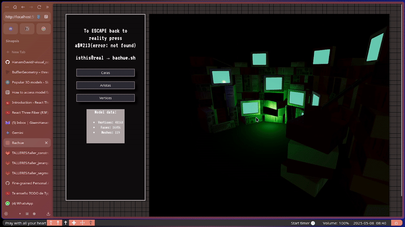
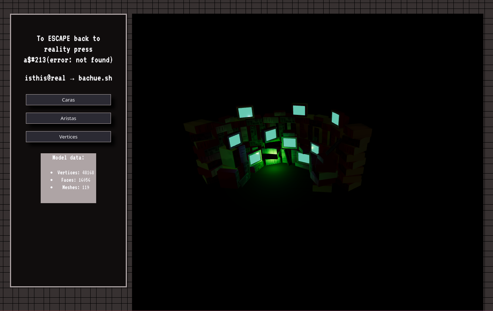
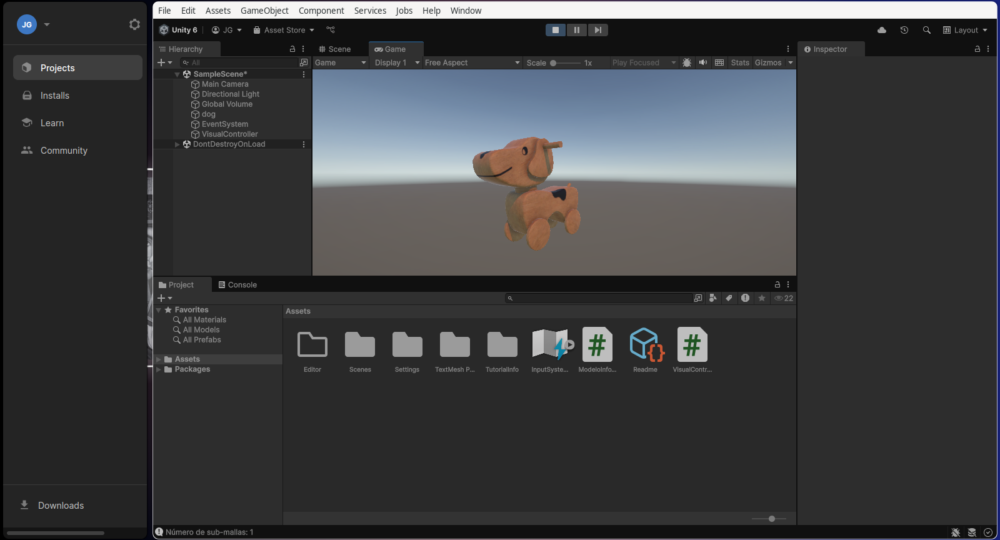
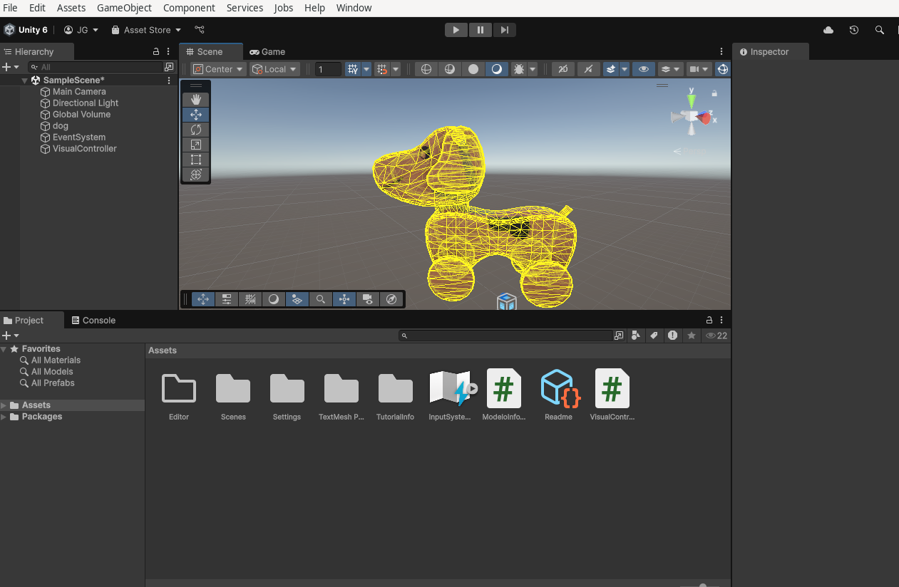

# 🧪 Taller - Construyendo el Mundo 3D: Vértices, Aristas y Caras
## 📅 2025-05-08 

---

## 🔍 Objetivo del taller
Comprender las estructuras gráficas básicas que forman los modelos 3D (mallas poligonales) y visualizar su estructura en distintas plataformas. Se explorará la diferencia entre vértice, arista y cara, así como el contenido de formatos de archivo estándar de malla como .OBJ, .STL y .GLTF.

---

## 🧠 Conceptos Aprendidos
- [x] Vértices
- [x] Aristas
- [x] Caras (Triángulos o Polígonos)
- [x] Mallas poligonales
- [x] Formatos de archivo 3D (.OBJ, .STL, .GLTF)
- [x] Visualización de estructuras de malla (wireframe, puntos)
- [ ] Shaders y efectos visuales

---

## 🛠️ Herramientas y Entornos
Especifica los entornos usados:
- [x] Three.js / React Three Fiber
- [x] Unity (versión LTS) (Opcional)

---
## 🧪 Implementación
 

Se trato de implementar todo con inyeccion de dependencias y modularidad para lograr completar la tarea exitosamente
### 🌐 Three.js con React Three Fiber
1.  Creación del proyecto con Vite y React Three Fiber.
2.  Carga de un modelo 3D (.OBJ, .STL o .GLTF) usando `@react-three/drei`.
3.  Implementación de `OrbitControls` para la navegación.
4.  Visualización de la estructura del modelo mediante:
    - `Edges` para resaltar aristas.
    - `Points` para visualizar vértices.
    - `Wireframe` material para ver las caras como líneas.
    
🎮 Unity (versión LTS) (Opcional)

    Creación de una escena 3D.
    Importación de un archivo .OBJ o .STL al proyecto.
    Adición del modelo importado a la escena.
    Creación de un script en C# (MeshInfo.cs) adjuntado al modelo.
    Implementación en el script para:
        Imprimir en la consola el número de vértices (mesh.vertices.Length), triángulos (mesh.triangles.Length / 3), y sub-mallas (mesh.subMeshCount).
        Activar la visualización en modo wireframe utilizando Gizmos.DrawWireMesh o modificando el material en el editor.
    (Opcional) Creación de botones UI para alternar entre un material sólido y un material de wireframe.
