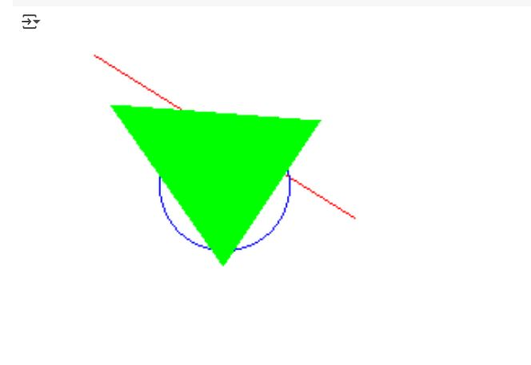

# Algoritmos de Rasterización

Este proyecto implementa algoritmos clásicos de rasterización para dibujar formas píxel a píxel sin usar librerías de alto nivel. Los algoritmos implementados son:

## Algoritmos Implementados

### 1. **Algoritmo de Línea de Bresenham**
El algoritmo de Bresenham se utiliza para dibujar una línea recta entre dos puntos `(x0, y0)` y `(x1, y1)`. Utiliza cálculos enteros, lo que lo hace eficiente y rápido para aplicaciones gráficas.

**¿Qué hace este código?**  
Este algoritmo calcula la posición de cada píxel que forma la línea, ajustando la dirección de la línea en función de la diferencia en las coordenadas de los puntos extremos. Con cada iteración, el algoritmo decide si el siguiente píxel debe estar más cerca de la coordenada X o Y en función del error acumulado. Este enfoque de decisiones discretas le da gran eficiencia y rapidez.

### 2. **Algoritmo de Círculo de Punto Medio**
Este algoritmo dibuja un círculo centrado en `(x0, y0)` con un radio dado. Utiliza la simetría del círculo para dibujar todos los puntos de las ocho secciones del círculo simultáneamente, lo que mejora la eficiencia.

**¿Qué hace este código?**  
El algoritmo comienza en un punto del círculo y, mediante una serie de cálculos basados en el parámetro `p`, decide si moverse en dirección horizontal o vertical para dibujar los puntos del círculo. Aprovecha la simetría del círculo para reducir el número de cálculos necesarios, lo que lo hace eficiente.

### 3. **Algoritmo de Relleno de Triángulo por Scanline**
Este algoritmo llena el interior de un triángulo dibujando cada fila horizontal (scanline) entre los bordes izquierdo y derecho del triángulo. El triángulo se rellena iterando a lo largo de las líneas horizontales dentro de los límites de la figura.

**¿Qué hace este código?**  
El algoritmo interpola las posiciones X de los bordes izquierdo y derecho del triángulo para cada fila, y luego dibuja todos los píxeles entre esos dos valores. Se utiliza el algoritmo de interpolación para encontrar las posiciones correctas de los bordes para cada fila del triángulo.

## Resultados

### Captura:

## Reflexión

### Diferencias entre los métodos:
- **Algoritmo de Bresenham**: Es ideal para dibujar líneas rectas porque solo usa operaciones enteras y toma decisiones basadas en los errores acumulados, lo que lo hace eficiente.
- **Algoritmo de Círculo de Punto Medio**: Utiliza la simetría del círculo y cálculos sencillos para dibujar un círculo. Es eficiente en términos de tiempo y precisión.
- **Algoritmo de Relleno de Triángulo por Scanline**: Rellena un triángulo utilizando la interpolación de los bordes. Es más lento debido a la necesidad de procesar cada fila horizontal (scanline), pero es efectivo para rellenar áreas cerradas.

### Velocidad y Precisión:
- **Velocidad**: Los algoritmos de **Bresenham** y **Punto Medio** son muy rápidos porque solo utilizan operaciones enteras y toman decisiones simples. El algoritmo de **Scanline** es más lento, ya que necesita interpolar y recorrer más píxeles.
- **Precisión**: Los tres algoritmos son precisos en su propósito: el de dibujar una línea recta, un círculo y un triángulo. No obstante, son aproximaciones a los modelos matemáticos ideales de estas formas, ya que trabajan con píxeles y no con coordenadas continuas.
