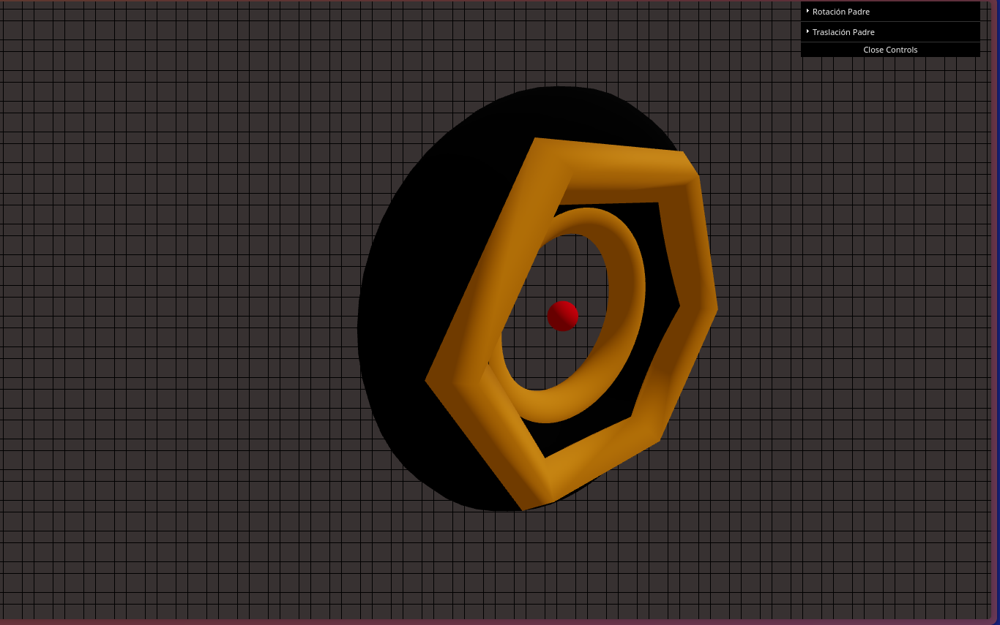
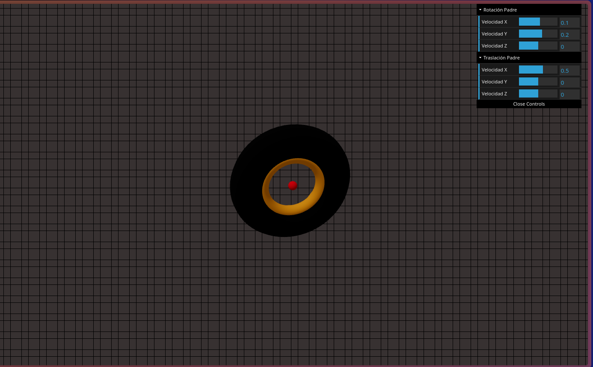
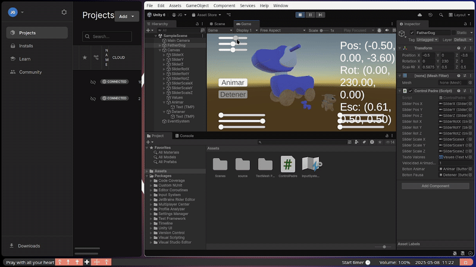
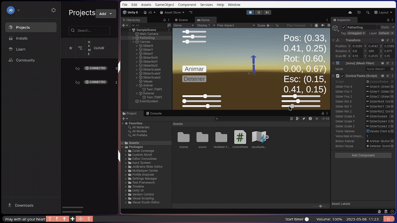

# 🧪 Taller 2: Estructuras Jerárquicas y Transformaciones en Escenas 3D
## 📅 2025-05-08 

---

## 🎯 Objetivo del Taller
Aplicar estructuras jerárquicas y árboles de transformación para organizar escenas y simular movimiento relativo entre objetos. Se busca comprender cómo las transformaciones afectan a los nodos hijos en una estructura padre-hijo y cómo visualizar estos efectos en tiempo real.

---

## 🧠 Conceptos Aprendidos
- [x] Transformaciones geométricas (escala, rotación, traslación)
- [x] Otro: Estructuras jerárquicas en escenas 3D
- [x] Otro: Herencia de transformaciones

---

## 🔧 Herramientas y Entornos
- [x] Unity (versión LTS, XR Toolkit, Shader Graph)
- [x] Three.js / React Three Fiber
---

## 🧪 Implementación

Ambos Proyectos fueron realizados poco a poco y tratando de buscar una buena modularidad diviendo el sistema
en varios componentes para asi lograr responder a los items de la tarea
### 🔹 Etapas realizadas

**Para Three.js / React Three Fiber:**
1.  Creación del proyecto con Vite y React Three Fiber.
2.  Implementación de la estructura padre-hijo con `<group>` y `<mesh>`.
3.  Aplicación de transformaciones (rotación y traslación) al nodo padre.
4.  Observación del comportamiento de los objetos hijos.
5.  Integración de `dat.GUI` para control en tiempo real con sliders.

**Para Unity (versión LTS):**
1.  Creación de una escena 3D con al menos tres objetos anidados jerárquicamente (padre → hijo → nieto).
2.  Creación de la interfaz de usuario (UI) con sliders para controlar las transformaciones del nodo padre.
3.  Implementación de un script en C# para vincular los sliders a las transformaciones del padre.
4.  Observación de cómo los objetos hijos heredan las transformaciones.
5.  Mostrar los valores actuales de posición, rotación y escala en la interfaz o consola.
6.  (Bonus) Implementación de la animación del padre y controles de pausa/reinicio en la UI.
 

