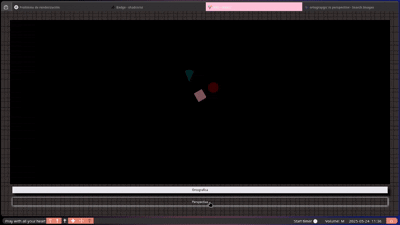
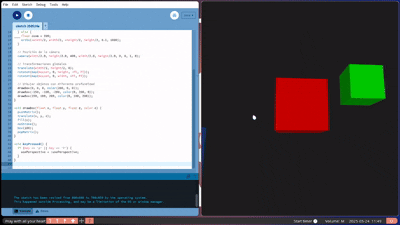

# 🧠  Geometría Proyectiva y Matrices de Proyección

## ✨ Objetivo del Taller

Este taller esta orientado a comprender y aplicar los conceptos fundamentales de la **geometría proyectiva** y el uso de **matrices de proyección**. Esto permitira representar escenas tridimensionales  modernas.

---


## 🚀 Actividades Prácticas

Hemos explorado estos conceptos a través de implementaciones en diversas plataformas:

### 1. 💻 Python:

Utilizando `matplotlib` y `numpy`, visualizamos la magia detrás de las proyecciones:

* Representamos puntos 3D en **coordenadas homogéneas**.
* Implementamos y aplicamos **matrices de proyección ortogonal y perspectiva**.
* Observamos el impacto de la **distancia focal** en la proyección, demostrando cómo una cámara "gran angular" o "teleobjetivo" distorsiona la escena.


```python
import numpy as np

def proyectar_perspectiva(puntos, d=1.0):
    P = np.array([
        [1, 0, 0, 0],
        [0, 1, 0, 0],
        [0, 0, 1, 0],
        [0, 0, 1/d, 0]
    ])
    puntos_hom = np.vstack((puntos, np.ones((1, puntos.shape[1]))))
    proy = P @ puntos_hom
    proy /= proy[-1, :]
    return proy[:-1]
# El código completo para generar puntos y proyectar se encuentra en la carpeta `python/`.
```
🌐 Three.js con React Three Fiber: Web 3D Interactivo

Construi una escena dinámica donde puedes cambiar entre cámaras ortográficas y perspectivas al instante. Gracias a @react-three/drei y OrbitControls, ¡puedes navegar libremente y sentir la diferencia en la profundidad!
JavaScript



4. 🎨 Processing (2D/3D): Creatividad Visual

Simulamos el comportamiento de las cámaras perspective() y ortho() en un entorno de programación visual, mostrando cómo estas funciones transforman los objetos en el eje Z.




✅ Criterios de Evaluación

    ✅ Aplicación correcta de las proyecciones: Implementación precisa de las matrices de proyección.
    ✅ Comparación gráfica clara: Visualizaciones que resalten las diferencias entre proyección ortogonal y perspectiva.
    ✅ Uso efectivo de OrbitControls: Integración fluida de los controles de navegación en Three.js.
    ✅ Código documentado: Comentarios y explicaciones claras en tu código fuente.
    ✅ README claro y visual: Este archivo que proporciona una visión general completa e incluye los elementos visuales solicitados.
    ✅ Organización impecable: Estructura de carpetas lógica y coherente con las directrices.
