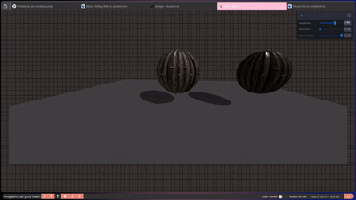

# 🧪 Taller - Materiales Realistas: Introducción a PBR en Unity y Three.js

## 📅 Fecha

`2025-05-24` – 

---

## 🌟 Objetivo del Taller

Comprender los principios del renderizado basado en física (PBR, Physically-Based Rendering) y aplicarlos a modelos 3D para mejorar su realismo visual. Comparar materiales con y sin texturas PBR.


## 🔧 Herramientas y Entornos

* Unity (2022 LTS, Shader Standard)
* Three.js / React Three Fiber (con Vite)
* Texturas de ambientCG y PolyHaven
* Leva (para UI interactiva)

---


---


### 🔹 Etapas realizadas


**Three.js / React Three Fiber**:

1. Crear escena con luz ambiental, direccional, plano y geometría.
2. Cargar texturas PBR:

   * Albedo (map)
   * Roughness (roughnessMap)
   * Metalness (metalnessMap)
   * Normal (normalMap)
3. Aplicar a un objeto y comparar con otro sin PBR.
4. Crear panel interactivo con Leva para modificar `roughness` y `metalness`.

### 🔹 Código relevante (React Three Fiber)

```jsx
import { useLoader } from '@react-three/fiber'
import { TextureLoader } from 'three'
import { useControls } from 'leva'

const textures = useLoader(TextureLoader, [
  '/textures/albedo.jpg',
  '/textures/roughness.jpg',
  '/textures/metalness.jpg',
  '/textures/normal.jpg',
])

const { roughness, metalness } = useControls({
  roughness: { value: 0.5, min: 0, max: 1 },
  metalness: { value: 0.5, min: 0, max: 1 },
})

<mesh>
  <boxGeometry args={[1, 1, 1]} />
  <meshStandardMaterial
    map={textures[0]}
    roughnessMap={textures[1]}
    metalnessMap={textures[2]}
    normalMap={textures[3]}
    roughness={roughness}
    metalness={metalness}
  />
</mesh>
```

---

## 📊 Resultados Visuales

### 📌 GIFs requeridos:




---

## 🧰 Prompts Usados

```text
"Genera una escena 3D con materiales PBR aplicando texturas albedo, roughness, metalness y normal"
"Haz una comparación entre materiales con y sin mapas PBR en Three.js"
```

---

## 💬 Reflexión Final

Este taller me permitió entender de forma clara la diferencia visual entre un material estándar y uno basado en física. Al aplicar mapas de normal, roughness y metalness, la luz interactúa de forma mucho más realista, generando texturas, reflejos y matices creíbles.

La parte más interesante fue ver el cambio en tiempo real al modificar los valores de `roughness` y `metalness`. Lo más desafiante fue la correcta carga y asignación de mapas para que coincidieran en escala y orientación. En el futuro, aplicaré estos conocimientos para crear visualizaciones más inmersivas y detalladas.


```markdown
- Implementé la escena en React Three Fiber
- Integré el panel de Leva para ajustes interactivos
- Capturé los GIFs y redacté el README
```

---

