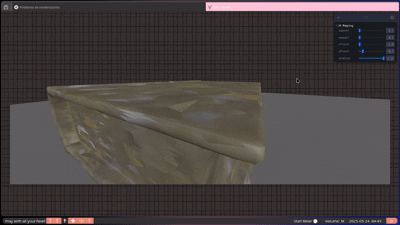

# 🧪 Taller - UV Mapping: Texturas que Encajan

## 🔍 Objetivo del Taller

Explorar el mapeo UV como técnica fundamental para aplicar correctamente texturas 2D sobre modelos 3D sin distorsión. El objetivo fue entender cómo se proyectan las texturas y cómo se pueden ajustar las coordenadas UV para mejorar el resultado visual.

## 🧱 Entornos Desarrollados

Este taller fue realizado en **Three.js con React Three Fiber**.

---


### Actividades

- Se importó un modelo `.glb` y se aplicó una textura panorámica 360° desde el interior de una esfera.

### Bonus

- Se aplicaron materiales PBR para evaluar su comportamiento con texturas complejas.

---

## 🌐 Three.js con React Three Fiber

### Actividades

### Texturizado PBR

- Se aplicaron mapas: `color`, `roughness`, `normal`, `displacement`.
- se usaron diferentes objetos para comparar.

### Carga de Modelo `.glb`

- Se usó `useGLTF` de `@react-three/drei` para cargar un modelo 3D.
- Se aplicaron texturas PBR de [AmbientCG](https://ambientcg.com).
- Se probaron distintos modelos para ver cómo afectan sus coordenadas UV.

### Opcional: UV Mapping Manual

- Se modificaron propiedades como `repeat`, `offset`, `wrapS` y `wrapT`.
- Se utilizó una textura tipo checkerboard para visualizar errores de distorsión UV.

---

## 📷 Evidencias Visuales




---

## 💬 Comentario Personal

Durante el taller fue necesario ajustar el `uvTransform` y modificar parámetros de wrapping para corregir errores como estiramiento o repetición no deseada. Usar modelos con UVs bien definidos facilitó el proceso. Fue muy útil ver el efecto de cada mapa PBR en tiempo real con la interfaz reactiva.

---

## 🧠 Prompts Usados

Prompts generados durante el taller con ayuda de ChatGPT:

- “Ayúdame a interpolar suavemente posiciones de cámara en React Three Fiber.”
- “Cargar texturas PBR y aplicarlas con MeshStandardMaterial.”

---

## 📁 Estructura del Repositorio

```plaintext
2025-05-24_taller_uv_mapping_texturas/
├── unity/
│   └── escena.unity
├── threejs/
│   ├── public/
│   │   ├── models/
│   │   │   └── model.glb
│   │   └── textures/
│   │       ├── color.jpg
│   │       ├── roughness.jpg
│   │       ├── normal.jpg
│   │       └── displacement.jpg
│   ├── src/
│   │   └── components/
│   │       ├── Scene.jsx
│   │       ├── Model.jsx
│   │       └── Controls.jsx
│   └── App.jsx
└── README.md
