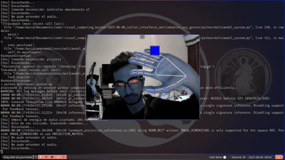
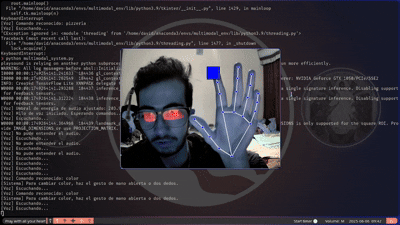

🧪 Taller - Interfaces Multimodales: Uniendo Voz y Gestos

📅 Fecha 2025-06-06 – Fecha de entrega o realización

🎯 Objetivo del Taller Este taller tiene como objetivo principal fusionar gestos (detectados con MediaPipe) y comandos de voz (reconocidos desde el micrófono) para realizar acciones compuestas dentro de una interfaz visual. Se busca introducir los fundamentos de los sistemas de interacción multimodal, combinando dos formas de entrada humana para enriquecer la experiencia de control y explorar el procesamiento simultáneo de señales.

🧠 Conceptos Aprendidos
Los principales conceptos aplicados y explorados en este taller incluyen:

[x] Transformaciones geométricas (implícitas en la detección de postura con MediaPipe)

[x] Segmentación de imágenes (implícita en la detección de gestos de MediaPipe)

[ ] Shaders y efectos visuales

[] Entrenamiento de modelos IA

[x] Comunicación por gestos (detección de manos y puntos clave con MediaPipe)

[x] Comunicación por voz (reconocimiento de voz simple)

[x] Procesamiento concurrente (manejo simultáneo de hilos para voz y gestos)

[x] Lógica condicional compuesta (ej. "si gesto Y voz Z, entonces acción A")

🔧 Herramientas y Entornos

Este taller se desarrolla principalmente en Python como núcleo de procesamiento. con conda y pip

🧪 Implementación
La implementación se centra en la captura y procesamiento simultáneo de gestos y voz para desencadenar acciones en una interfaz visual.
🔹 Etapas realizadas

Preparación del entorno: Instalación y configuración de las bibliotecas mediapipe, opencv-python, speech_recognition y pyaudio.

Captura de video y detección de gestos: Implementación de la captura de video en tiempo real desde la webcam y el uso de MediaPipe para detectar puntos clave de las manos y reconocer gestos (ej. mano abierta, dos dedos).

Captura de voz y reconocimiento de comandos: Configuración del micrófono y uso de speech_recognition para escuchar y transcribir comandos de voz simples.

Procesamiento y sincronización multimodal: Implementación de la lógica para capturar gestos y voz de forma concurrente (utilizando hilos o ciclos coordinados) y combinarlos para activar acciones específicas.Se estableció lógica condicional: Por ejemplo, "cambiar color" solo se activa si la mano está abierta Y se detecta el comando "cambiar".

Creación de una escena visual reactiva: Desarrollo de una interfaz visual (con tkinter o pygame) que responde a las combinaciones de gestos y voz, mostrando cambios de color, movimiento de objetos o texto de retroalimentación.

Guardado de resultados: Captura de GIFs animados para demostrar la interacción multimodal en funcionamiento.

🔹 Código relevante
El núcleo del taller radica en la integración de las entradas de voz y gestos:
```
import threading
# ... (otras importaciones y configuraciones)

# Lógica de detección de gestos con MediaPipe (ej. mano abierta)
def detect_gesture(hand_landmarks):
    # ... (implementación de la lógica del gesto)
    return is_hand_open

# Lógica de reconocimiento de voz (ej. escuchar "azul")
def recognize_voice_command():
    # ... (implementación del reconocimiento de voz)
    return command_text

# Bucle principal donde se combinan las entradas
def main_loop():
    while True:
        # Obtener estado actual del gesto (ej. mano abierta)
        current_gesture = detect_gesture(camera_feed_landmarks)

        # Iniciar hilo para escuchar comando de voz (no bloqueante)
        voice_thread = threading.Thread(target=recognize_voice_command)
        voice_thread.start()
        voice_thread.join(timeout=2) # Esperar un corto tiempo

        command = ""
        if voice_thread.is_alive(): # Si el hilo sigue activo, significa que no se reconoció nada rápido
            pass # O manejar la situación de no comando
        else:
            command = voice_thread._result # Obtener el resultado del hilo (ej. "azul")

        # Lógica de interacción multimodal
        if current_gesture == "mano_abierta" and "cambiar" in command:
            # Cambiar color en la interfaz visual
            update_visual_interface(color="next")
            print("Acción: Cambiar color!")
        elif current_gesture == "dos_dedos" and "mover" in command:
            # Mover objeto en la interfaz visual
            update_visual_interface(action="move_object")
            print("Acción: Mover objeto!")
        # ... (más lógica)

        # Actualizar la interfaz visual
        # update_visual_interface()

        # ... (control de bucle, ej. cv2.waitKey)
```
📊 Resultados Visuales📌 Este taller requiere explícitamente un GIF animado:✅ Se ha incluido al menos un GIF en la carpeta resultados/ mostrando la ejecución e interacción multimodal.El nombre del GIF es descriptivo del punto que se presenta.

Image of Interacción Voz + Gestos🧩 Prompts UsadosLos prompts utilizados para asistir en la creación de este taller y su documentación fueron:"Objetivo del Taller
[... resto de la descripción del taller de Kalman ...]
ahora hagamos este taller"


💬 Reflexión Final

Este taller ha sido una experiencia enriquecedora para comprender la complejidad y el potencial de las interfaces multimodales. Aprendí o reforcé la importancia de la sincronización y el procesamiento concurrente cuando se manejan múltiples flujos de entrada, como el video en tiempo real para gestos y el audio para voz. La parte más compleja fue, sin duda, la coordinación de estos dos flujos para que la lógica combinada fuera robusta y reactiva, evitando bloqueos o retrasos perceptibles. La selección de un motor de reconocimiento de voz y su integración fluida también presentó sus desafíos.Lo más interesante fue ver cómo una interacción que parecería trivial en la vida real, como "apuntar y decir", requiere un diseño cuidadoso de la lógica y la arquitectura de software. Mejoraría este proyecto explorando modelos de IA más avanzados para el reconocimiento de gestos y voz, lo que permitiría comandos más naturales y complejos, así como implementando un sistema de retroalimentación auditiva más sofisticado. En futuros proyectos, aplicaría estos principios para crear interfaces más intuitivas en aplicaciones de realidad aumentada o robótica, donde la interacción natural es clave.
