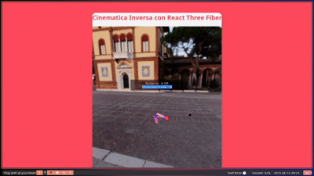
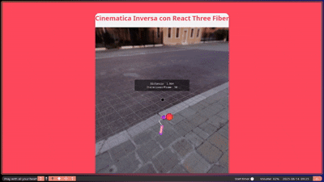

# Taller - Cinemática Inversa: Haciendo que el Modelo Persiga Objetivos

📅 Fecha: 2025-06-14

---

## 🎯 Objetivo del Taller

Aplicar cinemática inversa (IK, Inverse Kinematics) para que un modelo 3D alcance un punto objetivo dinámico, como una mano intentando tocar una esfera. Este ejercicio permite comprender cómo una cadena de articulaciones puede ajustarse automáticamente para alcanzar una posición deseada usando algoritmos como CCD (Cyclic Coordinate Descent) o FABRIK.

---

## 🧠 Conceptos Aprendidos

* Transformaciones geométricas (rotación, traslación)
* Cinemática Inversa (IK)
* Jerarquías de articulaciones
* Visualización interactiva 3D
* Algoritmos CCD y FABRIK

---

## 🔧 Herramientas y Entornos

* Three.js con React Three Fiber

---

## 📁 Estructura del Proyecto

```
2025-06-14_taller_cinematica_inversa_ik/
├── threejs/
├── README.md
```

---

## 🧪 Implementación


**Requisitos:**

* Crear una jerarquía de GameObjects con 3-4 segmentos (Base → Brazo → Antebrazo → Mano).
* Crear una esfera como objetivo.
* Crear script `IKSolverCCD.cs` para aplicar CCD en cada `Update()`.
* Mover el objetivo con controles o teclas.
* Visualizar la trayectoria del brazo con `Debug.DrawLine()`.
* Mostrar mensaje si el objetivo está fuera de alcance.

**Bonus:**

* Botón de "Reset Pose"
* UI para cambiar cantidad/largo de segmentos

### 🌐 Three.js con React Three Fiber

**Requisitos:**

* Crear escena con plano, <mesh> para eslabones, y esfera objetivo.
* Usar `useRef()` para cada segmento en jerarquía.
* Implementar `useFrame()` con algoritmo CCD o FABRIK:

  * CCD: desde la punta hacia la base, rotar cada segmento.
  * FABRIK: usar pasos forward-backward para ajustar posiciones.
* Visualizar trayectoria con `<Line>`.

**Bonus:**

* Mostrar distancia restante y número de iteraciones por frame.
* Switch IK/FK y animaciones entre poses predefinidas.

---

## 🔹 Código Relevante (React Three Fiber - CCD Solver)

```js
function solveIKCCD(segmentRefs, target, iterations = 10, threshold = 0.01) {
  for (let i = 0; i < iterations; i++) {
    for (let j = segmentRefs.length - 2; j >= 0; j--) {
      const current = segmentRefs[j].current;
      const endEffector = segmentRefs[segmentRefs.length - 1].current;

      const toEffector = new THREE.Vector3().subVectors(endEffector.position, current.position);
      const toTarget = new THREE.Vector3().subVectors(target, current.position);

      const angle = toEffector.angleTo(toTarget);
      if (angle < threshold) continue;

      const axis = toEffector.clone().cross(toTarget).normalize();
      const quaternion = new THREE.Quaternion().setFromAxisAngle(axis, angle);
      current.quaternion.premultiply(quaternion);
    }
  }
}
```

---

## 📊 Resultados Visuales




* Brazo articulado siguiendo objetivo
* GIF muestra casos alcanzados y fuera de alcance

---

## 🧩 Prompts Usados

* "Implement a CCD-based inverse kinematics solver for a 3D arm in React Three Fiber"
* "Explain step-by-step how to build an IK chain with FABRIK"

---

## 💬 Reflexión Final

Este taller permitió comprender de forma práctica los principios de cinemática inversa y su aplicación en cadenas jerárquicas. Se enfrentaron desafíos técnicos como el manejo de rotaciones acumulativas, orden de jerarquías y validación de distancias para evitar errores de cálculo.

Fue especialmente interesante ver cómo con unas pocas iteraciones, el brazo logra posicionarse con precisión sobre el objetivo. La visualización directa y la interacción en tiempo real con el objetivo hacen de este taller una excelente introducción a sistemas de animación automática en 3D.

---


---

## ✅ Checklist de Entrega

* [x] Carpeta `2025-06-14_taller_cinematica_inversa_ik`

