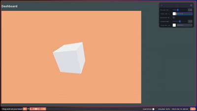

# 🧪 Taller - Dashboards Visuales 3D: Sliders y Botones para Controlar Escenas

📅 Fecha
2025-06-14

---

## 🎯 Objetivo del Taller

Construir interfaces gráficas 3D interactivas que permitan modificar propiedades de una escena en tiempo real mediante controles como sliders, botones y pickers. Se busca conectar entradas de usuario con transformaciones visuales de objetos y luces, creando una experiencia manipulable y didáctica en un entorno 3D.

---

## 🧠 Conceptos Aprendidos

- Control de propiedades visuales en tiempo real
- Uso de leva para crear UI reactiva
- Manipulación de materiales, luces y transformaciones
- Interacción entre lógica y visualización en 3D
- Estructuración de escenas interactivas

---

## 🔧 Herramientas y Entorno

- Three.js + React Three Fiber
- `leva` (interfaz UI reactiva)
- Vite para el entorno de desarrollo

---

## 📁 Estructura del Proyecto

\`\`\`
2025-06-14_taller_dashboards_visuales_3d_sliders_botones/
├── threejs/
│   ├── public/
│   ├── src/
│   │   └── App.jsx
\`\`\`

---

## 🧪 Implementación

### 🔹 Controles creados

- **Slider de Escala**: Controla la escala del eje X del objeto principal.
- **Selector de Color**: Cambia dinámicamente el color del material del objeto.
- **Botón de Rotación**: Activa/desactiva una rotación automática sobre el eje Y.

Todos los controles están enlazados en tiempo real usando `useControls()` de la librería `leva`, asegurando reactividad inmediata entre la interfaz y la escena 3D.

### 🔹 Código Relevante

\`\`\`jsx
const { scale, color, rotate } = useControls({
  scale: { value: 1, min: 0.2, max: 3, step: 0.1 },
  color: "#ff0055",
  rotate: false,
});

useFrame((state, delta) => {
  if (rotate) ref.current.rotation.y += delta;
  ref.current.scale.set(scale, scale, scale);
});
\`\`\`

---

## 📊 Resultados Visuales

✅ GIF animado mostrando el panel de control y la interacción:

---

---

## 💬 Reflexión Final

Este taller me permitió experimentar directamente con interfaces reactivas en 3D. El slider de escala resultó el más intuitivo y útil para visualizar cambios inmediatos en el objeto. El botón de rotación también fue interesante para introducir automatización simple.

Lo más desafiante fue sincronizar correctamente los controles con las propiedades del objeto sin causar efectos visuales indeseados. En el futuro, me gustaría explorar un panel flotante 3D dentro de la propia escena, en lugar de uno externo.

---

## ✅ Checklist de Entrega

- ✅ Carpeta `2025-06-14_taller_dashboards_visuales_3d_sliders_botones/`
- ✅ Código funcional con leva y React Three Fiber
- ✅ GIF incluido en carpeta `resultados/`
- ✅ README completo
- ✅ Commits descriptivos en inglés
