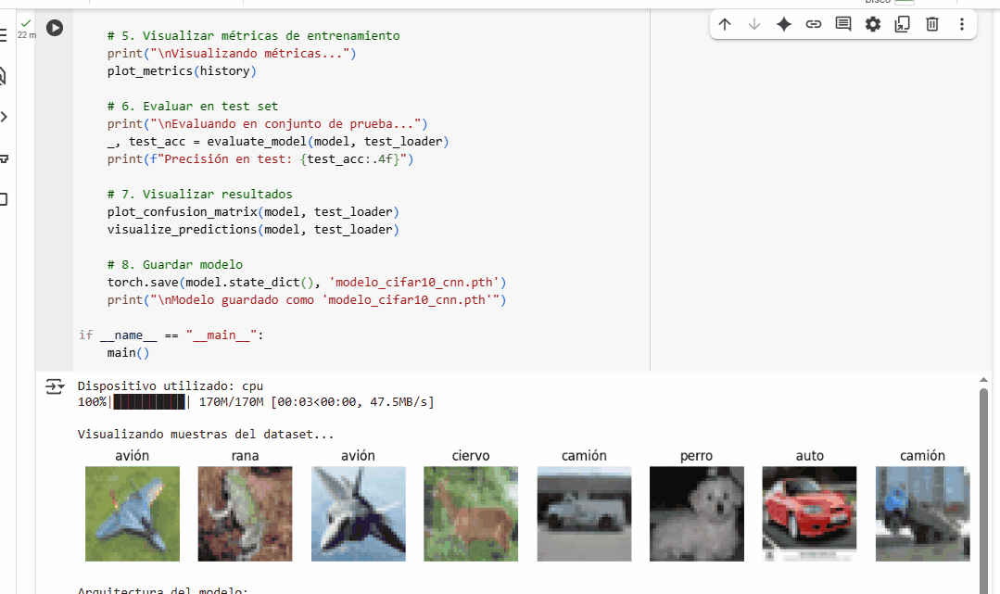

# 🧪 Taller - Redes Convolucionales desde Cero: CIFAR-10 con PyTorch

## 📅 Fecha  
2025-06-20 – Fecha de entrega

## 🎯 Objetivo
Implementar una red neuronal convolucional (CNN) desde cero para clasificación de imágenes usando el dataset CIFAR-10.

## 🧠 Conceptos Aplicados
- Capas convolucionales (Conv2d)
- Pooling (MaxPool2d)
- Funciones de activación (ReLU)
- Regularización (Dropout)
- Arquitectura secuencial de CNN

## 🔧 Herramientas Utilizadas
- Python 3.8+
- PyTorch 2.0+
- torchvision
- matplotlib
- scikit-learn

## 📁 Estructura del Proyecto
```bash
2025-06-20_taller_cnn_basico_deep_learning_keras_pytorch/
├── python/ 
│ └── entrenamiento_modelo_deep_learning.ipynb
├── resultados/ # gifs
├── README.md
```

## 📊 Resultados



## 💻 Código Relevante
```python
class CNN(nn.Module):
    def __init__(self):
        super(CNN, self).__init__()
        self.conv1 = nn.Conv2d(3, 32, kernel_size=3, padding=1)
        self.conv2 = nn.Conv2d(32, 64, kernel_size=3, padding=1)
        self.pool = nn.MaxPool2d(2, 2)
        self.fc1 = nn.Linear(64 * 8 * 8, 128)
        self.fc2 = nn.Linear(128, 10)
        self.dropout = nn.Dropout(0.25)
        self.relu = nn.ReLU()
    
    def forward(self, x):
        x = self.pool(self.relu(self.conv1(x)))
        x = self.pool(self.relu(self.conv2(x)))
        x = x.view(-1, 64 * 8 * 8)
        x = self.relu(self.fc1(x))
        x = self.dropout(x)
        x = self.fc2(x)
        return x
```
## 🧩 Prompts Usados
- "¿Cómo implementar una CNN básica en PyTorch para CIFAR-10 con dos capas convolucionales?"

- "¿Cómo generar una matriz de confusión con seaborn a partir de predicciones de PyTorch?"

- "Implementa una función para visualizar predicciones correctas e incorrectas"

## 💬 Reflexión Final
Este taller permitió comprender en profundidad los componentes fundamentales de las redes convolucionales. La parte más interesante fue ver cómo las capas convolucionales aprenden características jerárquicas, desde bordes simples en las primeras capas hasta patrones complejos en capas posteriores.

Para futuras mejoras, se podría:

Experimentar con arquitecturas más complejas (ResNet, VGG)

Aplicar técnicas de aumento de datos para mejorar generalización

Usar transfer learning con modelos preentrenados
