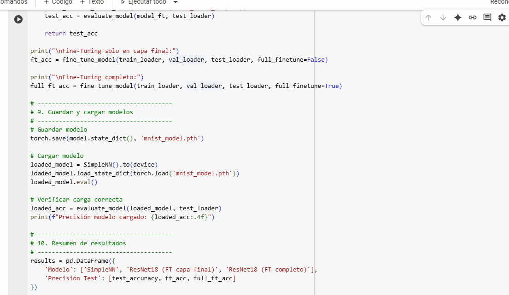
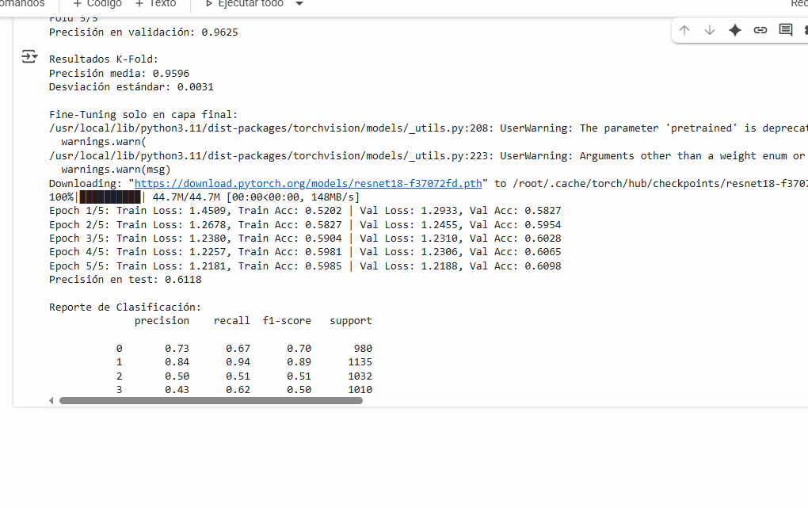

## 🧪 Taller - Entrenamiento de un Modelo de Deep Learning de Inicio a Fin  
## 📅 Fecha  
`2025-06-20` (fecha de realización)  

## 🎯 Objetivo del Taller  
Implementar un flujo completo de entrenamiento de modelos de Deep Learning, desde la preparación de datos hasta la evaluación, validación cruzada, fine-tuning y exportación del modelo.  

## 🧠 Conceptos Aprendidos  
- Preprocesamiento de datos (normalización, aumentación)  
- Arquitecturas de redes neuronales (MLP, ResNet)  
- Validación cruzada (K-Fold) y hold-out  
- Fine-tuning de modelos preentrenados  
- Visualización de métricas (matrices de confusión, curvas de aprendizaje)  

## 🔧 Herramientas y Entornos  
- Python 3.8+  
- Librerías: torch, torchvision, sklearn, matplotlib, seaborn  
- Entorno: Google Colab

## 📁 Estructura del Proyecto  
```bash
├── python/
│ └── entrenamiento_modelo.ipynb
├── resultados/
│ ├── modelo_SimpleNN.gif
│ ├── ResNet18.gif
└── README.md

```
## 🧪 Implementación  

🔹 Etapas realizadas  
1. Carga y visualización del dataset MNIST  
2. Preparación de DataLoaders (train/val/test)  
3. Entrenamiento de modelo SimpleNN desde cero  
4. Validación cruzada (5-Fold)  
5. Fine-tuning de ResNet18 (parcial y completo)  
6. Evaluación comparativa y guardado de modelos  

🔹 Código relevante  
```python
# Modelo básico
model = nn.Sequential(
    nn.Flatten(),
    nn.Linear(28*28, 128),
    nn.ReLU(),
    nn.Linear(128, 10)
)
# Fine-tuning ResNet18
model_ft = models.resnet18(pretrained=True)
model_ft.fc = nn.Linear(model_ft.fc.in_features, 10)
```
## 📊 Resultados Visuales





## 💬 Reflexión Final
Este taller permitió consolidar el flujo completo de desarrollo de modelos de Deep Learning, destacando la importancia de la evaluación rigurosa mediante validación cruzada. La parte más interesante fue comparar el rendimiento entre el modelo desde cero y las estrategias de fine-tuning.

Para futuras iteraciones, sería valioso incorporar más datasets (como CIFAR-10) y técnicas avanzadas como learning rate scheduling. El conocimiento adquirido será fundamental para proyectos de clasificación de imágenes más complejos.
