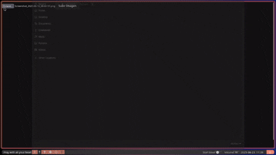
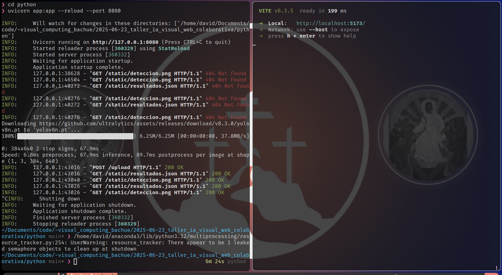

# 🧪 IA Visual Colaborativa: Comparte tus Resultados en Web

📅 Fecha
2025-06-23 – Fecha de entrega o realización

---

## 🎯 Objetivo del Taller

Este taller tiene como objetivo construir un sistema completo de detección visual con IA en tiempo real, registrar los resultados y visualizarlos en una página web 3D interactiva. Se busca aplicar modelos de detección como YOLOv8, exportar datos como JSON + imagen, y renderizarlos en una escena con React Three Fiber.

---

## 🧠 Conceptos Aprendidos

- Transformaciones geométricas (escala, rotación, traslación)
- Segmentación y detección de imágenes
- Visualización de bounding boxes en 3D
- Comunicación entre backend IA y frontend 3D
- Otro: Visualización web colaborativa con datos generados por IA

---

## 🔧 Herramientas y Entornos

- **Python** (ultralytics/yolov8, opencv-python, uvicorn, fastapi)
- **Three.js / React Three Fiber** (Vite, Drei, Zustand)
- **Jupyter / Google Colab** (opcional para entrenamiento)
- 📌 Usa las herramientas según la guía de instalación oficial

---


## 🧪 Implementación

### 🔹 Etapas realizadas

1. Subir imagen en el frontend y detectar todo con el back en YOLO y Fast API.
2. Exportación de resultados como `deteccion.png` + `resultados.json`.
3. Visualización en 3D con React Three Fiber usando `Html`, `Plane`, `Box` y `TextureLoader`.

### 🔹 Código relevante

```python
# backend/deteccion.py
result = model(source=frame, save=False, save_txt=False)
result.save(filename="backend/resultados/deteccion.png")
result.export_json("backend/resultados/resultados.json")
```
###  Reflexión Final


Este taller me permitió integrar modelos de IA con una visualización web moderna en tiempo real. Aprendí cómo coordinar diferentes capas tecnológicas (detección con Python, renderizado con React Three Fiber, y exportación de resultados) en un flujo funcional y atractivo.
📽️ GIF de la ejecución (detección en vivo y visualización):



🖼️ Imagen estática como respaldo:


