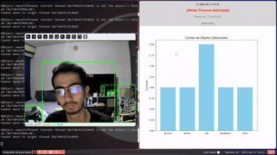
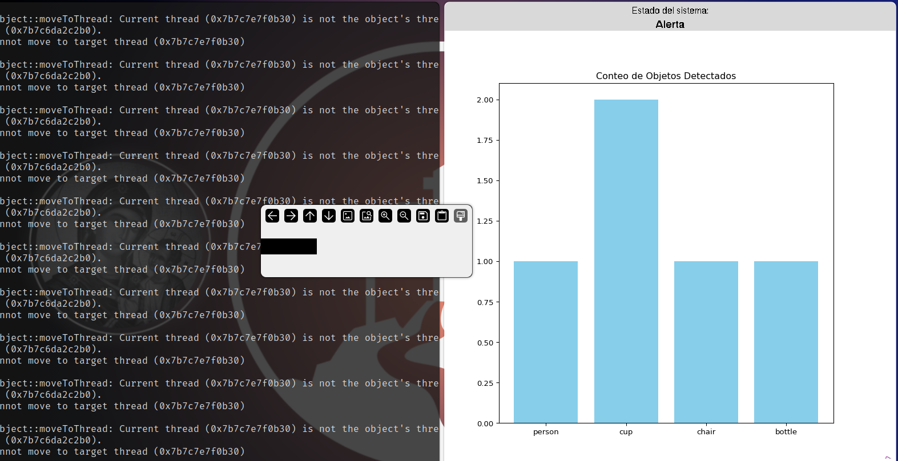

# 🧪 Taller: Sistema de Monitoreo Inteligente con YOLOv8 y Tkinter

📅 Fecha
2025-06-23 – Fecha de entrega

---

## 🎯 Objetivo del Taller

Diseñar e implementar un sistema modular de monitoreo inteligente en Python que permita visualizar en vivo una cámara, detectar personas en tiempo real utilizando YOLOv8, mostrar estadísticas de objetos detectados mediante una interfaz gráfica con Tkinter y registrar capturas solo si se detecta una persona.

---

## 🧠 Conceptos Aprendidos

- ✅ Transformaciones geométricas (detección de bounding boxes)
- ✅ Segmentación de imágenes (detección por clases)
- ✅ Entrenamiento y aplicación de modelos IA (uso de YOLOv8)
- ✅ Comunicación visual con interfaz (Tkinter + Matplotlib)
- 🔲 Comunicación por gestos o voz
- ✅ Otro: Uso de hilos (multithreading) para modularizar captura, detección y visualización

---

## 🔧 Herramientas y Entornos

- **Python 3.10+**
  - `ultralytics` (YOLOv8)
  - `opencv-python`
  - `matplotlib`
  - `tkinter`
  - `threading`, `datetime`, `csv`
- Sistema Operativo: Linux / Windows
- Cámara integrada o USB

📌 Todas las librerías fueron instaladas en un entorno virtual limpio siguiendo la guía oficial.

---


---

## 🧪 Implementación

### 🔹 Etapas realizadas

1. **Inicialización del entorno**: instalación de paquetes y descarga del modelo YOLOv8n.
2. **Construcción modular**: separación en `deteccion.py`, `panel.py` y `main.py`.
3. **Captura y procesamiento en tiempo real**: detección y visualización.
4. **Visualización y alertas**: alerta visual cuando se detecta una persona y guardado automático.

### 🔹 Código relevante

```python
# deteccion.py – Detección y anotación con YOLOv8
resultados = modelo(frame)[0]
for box in resultados.boxes:
    clase = int(box.cls[0])
    if modelo.names[clase] == 'person':
        # Alerta: persona detectada
        personas.append({...})
    # Dibujo del bbox en frame
    cv2.rectangle(...)
```
### 📊 Resultados Visuales
🎥 Ejecución del sistema

    Vista del sistema en tiempo real, mostrando detecciones de personas y actualizando estadísticas en la interfaz.



🖼️ Captura cuando se detecta persona

    Cuando se detecta una persona, el sistema guarda automáticamente una imagen con fecha y hora.



💬 Reflexión Final

Este taller me permitió integrar múltiples habilidades en un solo proyecto: desde el uso de modelos de visión artificial hasta el diseño de interfaces gráficas en Python. Reforcé mis conocimientos sobre detección de objetos con YOLOv8 y aprendí a gestionar hilos (threading) para lograr una arquitectura modular y eficiente.

Uno de los mayores desafíos fue asegurar que la detección en tiempo real no interfiera con la visualización gráfica, ni con la captura automática de imágenes. El manejo cuidadoso de hilos permitió separar las responsabilidades y evitar bloqueos o caídas de la aplicación. También fue clave validar los datos visuales antes de mostrar o guardar imágenes, especialmente cuando se trabajaba con OpenCV y Tkinter en paralelo.

Considero que este sistema tiene potencial para escalarse, por ejemplo, añadiendo una API web para alertas remotas o conectando con almacenamiento en la nube. En futuros proyectos, buscaría integrar este tipo de sistemas con IoT o dashboards remotos para una solución más completa.

