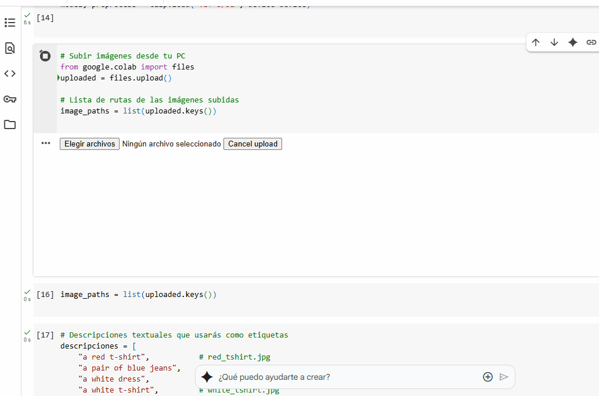

# 🧪 Taller - Text + Imagen: Clasificación Asistida para Moda

📅 Fecha  
2025-07-04 – Fecha de realización

---

## 🎯 Objetivo del Taller

Explorar cómo la combinación de texto descriptivo y visualización puede mejorar la clasificación de imágenes difíciles de interpretar. Se utilizó el modelo CLIP (de OpenAI) para clasificar prendas de ropa a partir de descripciones en lenguaje natural, y se comparó su desempeño con un clasificador tradicional (SVM) basado en embeddings visuales extraídos con ResNet18.

---

## 🧠 Conceptos Aprendidos

- Representaciones semánticas mediante embeddings de CLIP
- Clasificación de imágenes usando descripciones en lenguaje natural
- Extracción de características con redes convolucionales (ResNet)
- Comparación entre clasificación supervisada y zero-shot
- Visualización de resultados y evaluación de precisión

---

## 🔧 Herramientas y Entornos

- Python (torch, torchvision, clip, Pillow, matplotlib, scikit-learn)
- Google Colab

📌 Herramientas instaladas vía pip, según guía oficial.

---

## 📁 Estructura del Proyecto

```bash
2025-07-04_taller_clasificacion_asistida_texto_imagen_clip/
├── python/
├── datasets/
├── resultados/
├── README.md
```
---
## 🧪 Implementación

### 🔹 Etapas realizadas

1. **Preparación del dataset**  
   Se cargaron 6 imágenes manualmente (t-shirts, jeans, vestidos y pantalones).

2. **Aplicación del modelo CLIP**  
   Cada imagen fue comparada contra descripciones en lenguaje natural usando el modelo preentrenado `ViT-B/32`.

3. **Clasificador tradicional**  
   Se extrajeron features con ResNet18 (sin la capa final) y se entrenó un SVM lineal para clasificar las mismas imágenes.

4. **Visualización y evaluación**  
   Se imprimieron predicciones y se calculó precisión del modelo tradicional (`accuracy_score`).

### 🔹 Código relevante

```python
# Comparar imagen con texto usando CLIP
text_inputs = clip.tokenize(descripciones).to(device)
image_input = preprocess(Image.open("red_tshirt.jpg")).unsqueeze(0).to(device)

with torch.no_grad():
    logits_per_image, _ = model(image_input, text_inputs)
    probs = logits_per_image.softmax(dim=-1).cpu().numpy()

# Clasificación tradicional con SVM
resnet = models.resnet18(pretrained=True)
resnet.fc = torch.nn.Identity()
resnet.eval().to(device)

clf = SVC(kernel="linear")
clf.fit(imagenes, etiquetas)
```
---
## 📊 Resultados Visuales


---

## 🧩 Prompts Usados
No se usaron prompts generativos. Las descripciones textuales escritas manualmente fueron:

 - "a red t-shirt"

 - "a pair of blue jeans"

 - "a white dress"

 - "a white t-shirt"

 - "a red dress"

 - "a pair of black pants"

📎 Descripciones alineadas semánticamente con las clases visuales.

---

## 💬 Reflexión Final
Este taller me permitió entender cómo los modelos multimodales como CLIP pueden clasificar imágenes sin entrenamiento explícito, simplemente comparándolas con descripciones en lenguaje natural. Es sorprendente la precisión que puede alcanzarse incluso con pocas imágenes, y sin necesidad de etiquetas numéricas.

La parte más interesante fue observar cómo CLIP logra capturar similitudes semánticas, mientras que el SVM depende completamente del entrenamiento previo. Esto refuerza el poder del aprendizaje zero-shot. En futuros proyectos, me gustaría extender este enfoque con más clases, más imágenes por categoría, y usar validación cruzada para evaluar la capacidad de generalización.
