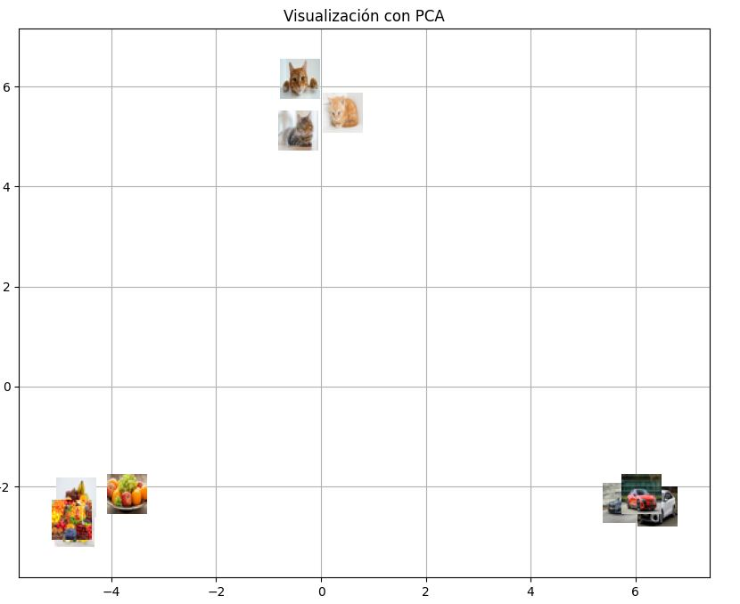
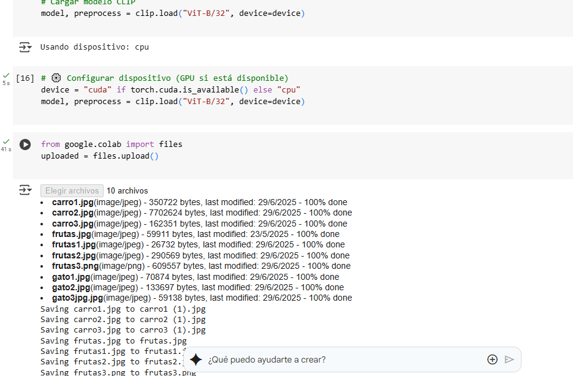

# 🧪 Taller - Embeddings Visuales: Proyectando Significados con CLIP y PCA

📅 Fecha  
2025-07-04 – Fecha de entrega o realización

---

## 🎯 Objetivo del Taller

Explorar cómo los modelos de visión por computadora (en este caso, CLIP de OpenAI) codifican el significado visual de imágenes en un espacio latente. El objetivo fue generar embeddings a partir de imágenes y proyectarlos a 2D utilizando técnicas de reducción de dimensionalidad (PCA o t-SNE), permitiendo visualizar agrupamientos semánticos sin etiquetas explícitas.

---

## 🧠 Conceptos Aprendidos

- Embeddings visuales
- Modelos de visión preentrenados (CLIP)
- Reducción de dimensionalidad (PCA, t-SNE)
- Visualización de datos en espacios latentes
- Aprendizaje no supervisado (unsupervised learning)
- Agrupamiento semántico emergente

---

## 🔧 Herramientas y Entornos

- Python (Google Colab)
- Librerías: `torch`, `numpy`, `Pillow`, `matplotlib`, `scikit-learn`, `clip` (OpenAI)
- Visualización: `matplotlib.offsetbox` para miniaturas

📌 Se utilizó Google Colab para cargar las imágenes, procesarlas con CLIP, reducir dimensionalidad y generar visualizaciones interactivas.

---

## 📁 Estructura del Proyecto

```bash
2025-07-04_taller_embeddings_visuales_clip_pca/
├── python/
├── images/               # imágenes del dataset
├── graficos/             # resultados de PCA/t-SNE
├── README.md
```

---

## 🧪 Implementación

### 🔹 Etapas realizadas

1. **Preparación de datos**: Se subieron 6 imágenes (gatos y carros) al entorno de Colab.
2. **Generación de embeddings**: Las imágenes se pasaron por el modelo CLIP (`ViT-B/32`) para obtener vectores de 512 dimensiones.
3. **Reducción de dimensionalidad**: Se aplicó PCA para proyectar los embeddings a un espacio 2D.
4. **Visualización**: Se graficaron las imágenes como miniaturas sobre sus coordenadas en el plano 2D usando `AnnotationBbox`.

### 🔹 Código relevante

```python
with torch.no_grad():
    image_features = [model.encode_image(img).cpu().numpy() for img in images]
X = np.vstack(image_features)

X_pca = PCA(n_components=2).fit_transform(X)

# Visualización
from matplotlib.offsetbox import OffsetImage, AnnotationBbox
fig, ax = plt.subplots(figsize=(10, 8))
for i, path in enumerate(image_paths):
    img = Image.open(path).resize((32, 32))
    im = OffsetImage(img, zoom=1)
    ab = AnnotationBbox(im, (X_pca[i, 0], X_pca[i, 1]), frameon=False)
    ax.add_artist(ab)

```
## 📊 Resultados Visuales
📌 Se generó la visualización en 2D que muestra claramente un agrupamiento de gatos en una zona del espacio latente y carros en otra, demostrando que CLIP logra separar semánticamente los contenidos visuales.


✅ También se generó el siguiente GIF mostrando la transición desde embeddings crudos hasta la proyección visual:

## 💬 Reflexión Final
Este taller me permitió entender de forma concreta cómo los modelos de IA pueden capturar similitud semántica en imágenes sin necesidad de etiquetas humanas. Fue muy interesante ver cómo CLIP agrupa de forma automática gatos con gatos y carros con carros, simplemente a partir de su entrenamiento previo.

La parte más retadora fue generar visualizaciones claras en 2D sin que las imágenes se superpusieran, lo cual se resolvió con AnnotationBbox. En el futuro, me gustaría extender este experimento incluyendo imágenes más variadas y también analizar cómo se relacionan textos y descripciones usando encode_text() de CLIP para crear mapas semánticos multimodales.
