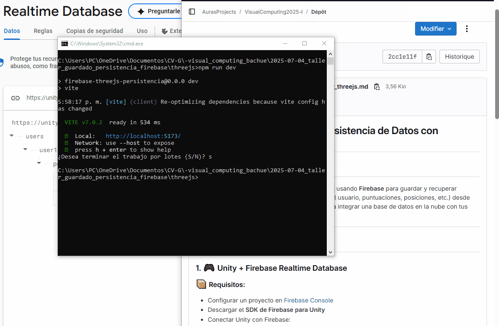

# 🧪 Persistencia con Firebase en Three.js
Solo se pudo hacer en Three.js ya que unity era muy pesado y no lo podia abrir.
📅 Fecha  
2025-07-04 – Fecha de realización

---

## 🎯 Objetivo del Taller

Implementar un sistema de persistencia de datos en una escena 3D utilizando Firebase y Three.js (con React Three Fiber). El objetivo es que un objeto 3D guarde su posición automáticamente cada cierto intervalo de tiempo, y al recargar la escena, se recupere esa posición desde la base de datos en tiempo real.

---

## 🧠 Conceptos Aprendidos

- Transformaciones geométricas (traslación y rotación en 3D)
- Comunicación con base de datos en tiempo real (Firebase Realtime Database)
- Hooks de React (`useState`, `useRef`, `useEffect`)
- Renderizado 3D con React Three Fiber (`Canvas`, `mesh`, `OrbitControls`)
- Modularización del código en React
- Sincronización entre UI y datos remotos

---

## 🔧 Herramientas y Entornos

- 🟦 **Three.js / React Three Fiber**
- 🔥 **Firebase Realtime Database**
- ⚛️ React 18 con Vite
- 📦 npm (`firebase`, `@react-three/fiber`, `@react-three/drei`)

---

## 📁 Estructura del Proyecto
```bash
2025-07-04_taller_guardado_persistencia_firebase/
├── threejs/
│   ├── src/firebase/firebaseConfig.js
│   ├── src/components/ObjetoPersistente.jsx
├── README.md

```
---

## 🧪 Implementación

### 🔹 Etapas realizadas

1. **Configuración de Firebase**: Se creó un proyecto y se activó Realtime Database.
2. **Inicialización en React**: Se importó y configuró Firebase en `firebaseConfig.js`.
3. **Diseño de escena**: Se renderizó un cubo naranja oscilando con `sin(t)`.
4. **Persistencia automática**: Cada 3 segundos se guarda la posición en Firebase.
5. **Recuperación al iniciar**: Al montar el componente, se recupera la posición previa.

---

### 🔹 Código relevante

```jsx
// 🔁 Guardar posición cada 3 segundos
useEffect(() => {
  const interval = setInterval(() => {
    const { x, y, z } = meshRef.current.position;
    set(ref(db, "users/user1/position"), { x, y, z });
  }, 3000);

  return () => clearInterval(interval);
}, []);

// 🔄 Recuperar al iniciar
useEffect(() => {
  const posRef = ref(db, "users/user1/position");
  get(posRef).then((snapshot) => {
    if (snapshot.exists()) {
      const { x, y, z } = snapshot.val();
      setPosInicial([x, y, z]);
    }
  });
}, []);
```
---

## 📊 Resultados Visuales
📌 Este taller requiere explícitamente un GIF animado:

✅ A continuación, un ejemplo del resultado, donde el cubo se mueve y guarda su posición:


---
## 🧩 Prompts Usados

"Create a real-time 3D scene where an object’s position is saved to the cloud every few seconds using Firebase."

"Use React Three Fiber to animate a cube and persist its movement state in Firebase Realtime Database."

"Build an interactive 3D app where object coordinates are retrieved from Firebase and used to set its initial position."

## 💬 Reflexión Final
Este taller fue útil para comprender cómo conectar una escena 3D con una base de datos en tiempo real. Aprendí a utilizar useEffect en React para sincronizar acciones periódicas (guardado) y eventos al cargar (recuperación). Además, reforcé el uso de referencias (useRef) para acceder a propiedades del objeto 3D.

La parte más interesante fue ver cómo los datos persistidos permiten mantener la continuidad en la experiencia visual. La mayor dificultad fue lograr que la sincronización con Firebase no interrumpiera el renderizado en tiempo real. En futuros proyectos, aplicaría este mismo enfoque para guardar estados de cámara, múltiples objetos, o interacciones de usuario persistentes.
