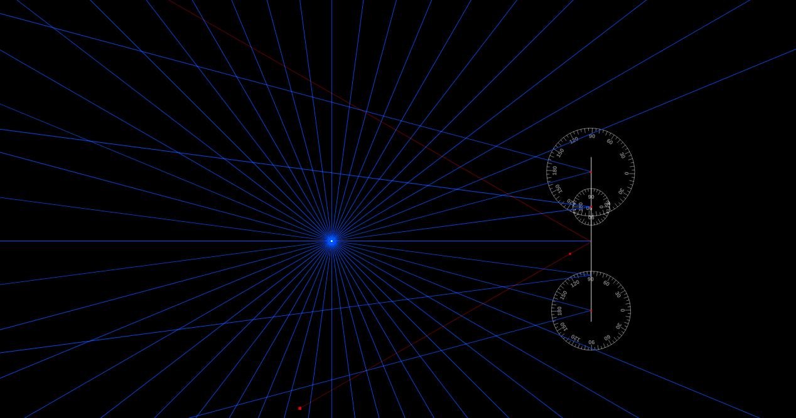
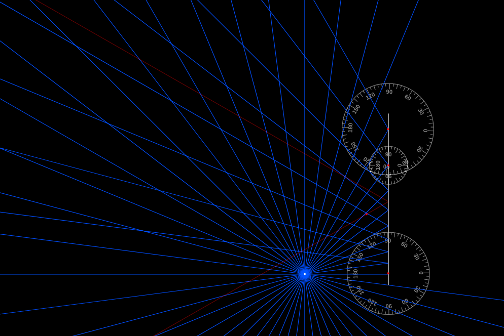
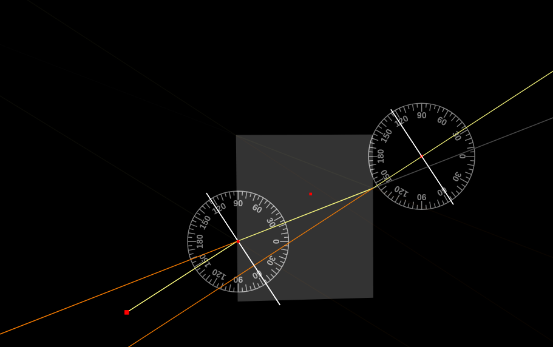
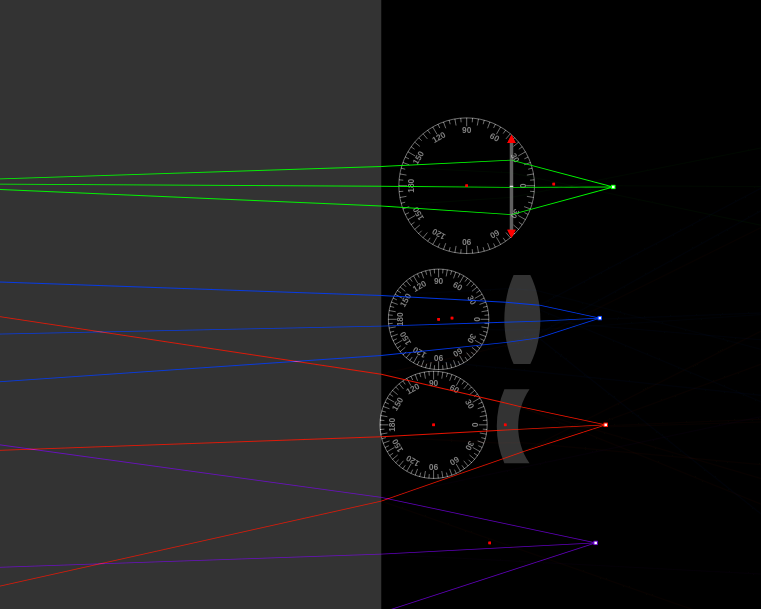
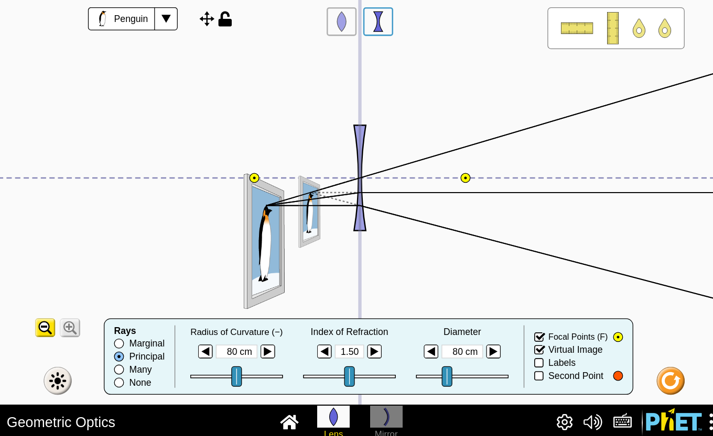
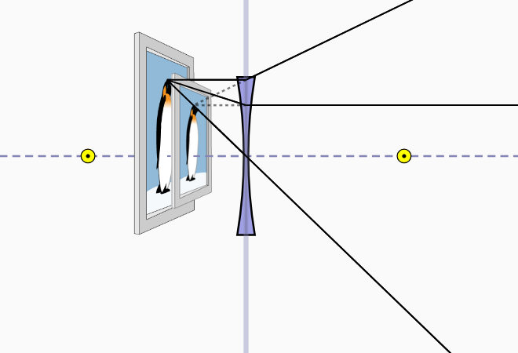
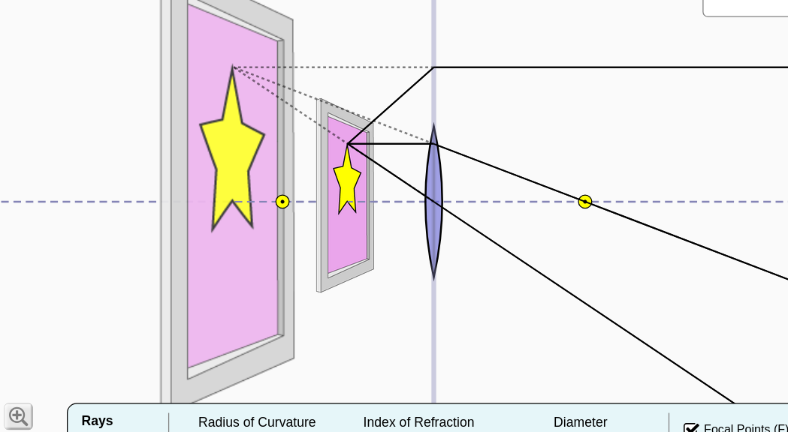

# Informe: Óptica Geométrica - Reflexión, Refracción y Formación de Imágenes

## Objetivo del Taller

Explorar los fundamentos de la óptica geométrica mediante simulaciones visuales interactivas, observando y registrando el comportamiento de los rayos al interactuar con superficies reflectantes, materiales refractivos y sistemas ópticos formadores de imágenes.

Actividades por Fenómeno

## REFLEXIÓN

Actividad 1 - Simulador: Ray Optics Simulator

    Se colocó un espejo plano y una fuente de rayo puntual. Se activaron los rayos reflejados y se dibujó una línea perpendicular al espejo como referencia visual.

Captura:

Descripción:

    El rayo rebota con simetría respecto a la línea perpendicular. El ángulo de incidencia es igual al ángulo de reflexión.

    Al mover la fuente de luz, los rayos reflejados también cambian de dirección, manteniendo la simetría con respecto a la línea perpendicular, como se puede observar en la siguiente imagen.

REFRACCIÓN

Actividad 2 - Simulador: Ray Optics Simulator

    Se colocó un bloque de vidrio y se lanzó un rayo en ángulo. Se activaron los rayos refractados y se trazaron líneas normales en los puntos de entrada y salida.

Captura:

Descripción:

    Sí, los rayos cambian de dirección al entrar y al salir del bloque de vidrio.

    El rayo dentro del vidrio se desvía hacia la normal al entrar y se aleja de la normal al salir, volviendo a su dirección original pero desplazado.

Actividad 3 - Simulador: Ray Optics Simulator

    Se cambió el medio exterior a vidrio y se lanzó un rayo en diagonal hacia una lente. Se comparó el comportamiento del rayo en aire vs con diferentes lentes para tratar de ver mas como afectan los vidrios la reflexion

Captura:

Descripción:

    En el aire, los rayos se curvan más al atravesar la lente. En el vidrio, la curvatura es menor. Esto se debe a la menor diferencia en el índice de refracción entre el medio exterior (vidrio) y el material de la lente (vidrio).

    El trayecto del rayo antes y después de la lente cambia significativamente. En el aire, la lente causa una mayor convergencia o divergencia de los rayos. En el vidrio, el efecto de la lente sobre la dirección de los rayos es menos pronunciado.

FORMACIÓN DE IMÁGENES

Actividad 4 - Simulador: PhET - Óptica Geométrica

    Se agregó una lente convergente y un objeto. Se activaron los rayos principales y los focos. Se deslizó el objeto hacia distintas posiciones para observar la formación de la imagen nítida en la pantalla.

Captura:

Descripción:

    En esta configuración, la imagen es más pequeña que el objeto.

    Al mover el objeto más cerca de la lente, la imagen se aleja de la lente y su tamaño aumenta. Si el objeto se mueve al foco o entre el foco y la lente, la imagen se vuelve virtual y se forma en el mismo lado que el objeto, sin proyectarse en una pantalla real.

Actividad 5 - Simulador: PhET - Óptica Geométrica

    Se cambió la lente por un espejo cóncavo. Se colocó el objeto muy cerca del espejo.

Captura:

Descripción:

    No, los rayos reflejados no se cruzan en el caso de la imagen mostrada. En esta configuración (objeto entre el foco y el espejo), los rayos parecen provenir de un punto detrás del espejo, formando una imagen virtual.

    La imagen se forma detrás del espejo. Es una imagen virtual, derecha y aumentada.
