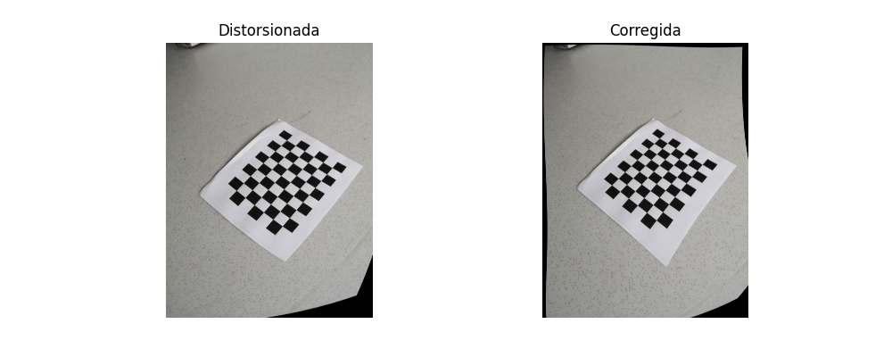
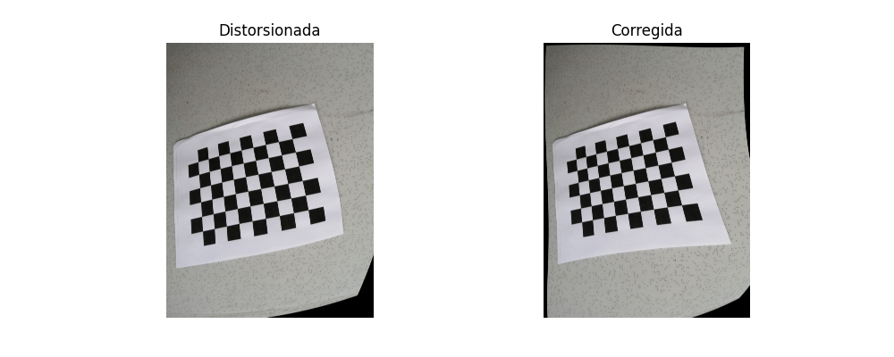
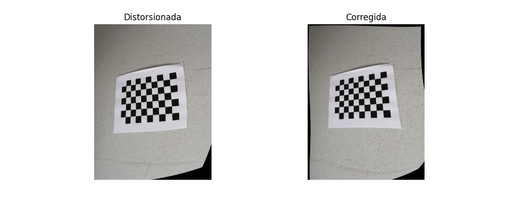

# Taller de Calibración de Cámara y Corrección de Distorsión con OpenCV

## Autores
- Nicolas Arciniegas
- Diego Andres Alvarez Gonzalez
- Juan David Guarnizo Gutierrez
- Lizeth Mariana Garcia
 
Ingeniería de Sistemas – Universidad Nacional de Colombia


## Objetivo del Taller

Simular un defecto óptico introduciendo **una distorsión artificial suave** a imágenes reales capturadas de un patrón de ajedrez, para luego realizar el proceso completo de:

1. **Detección del patrón en imágenes distorsionadas**
2. **Calibración de la cámara con OpenCV**
3. **Corrección de las imágenes**
4. **Comparación visual entre distorsionadas y corregidas**

---

## 🗂️ Estructura del Proyecto

```
📁 imagenes_originales/          # Imágenes reales del patrón de ajedrez
📁 imagenes_distorsionadas/      # Versión con distorsión artificial leve◊
📁 imagenes_corregidas/          # Imágenes corregidas usando cv2.undistort
📁 imagenes_comparadas/          # Comparaciones para el informe
📄 notebook_calibracion.ipynb    # Código completo del taller
📄 informe_calibracion.md        # Este informe
```

---

## Proceso Realizado

1. Se cargaron 15 imágenes del patrón de ajedrez (9x6 esquinas internas).
2. Se aplicó una **distorsión artificial leve** usando coeficientes:
   ```python
   dist_coeffs_sim = np.array([[-0.01, 0.0002, 0.0, 0.0, 0.0]])
   ```
3. Se detectaron correctamente las esquinas del tablero en al menos 5 imágenes.
4. Se realizó la **calibración de cámara** con `cv2.calibrateCamera()`, obteniendo:

   - **Matriz de calibración:**
     ```
     [[ fx    0   cx]
      [  0   fy   cy]
      [  0    0    1]]
     ```

   - **Coeficientes de distorsión:**  
     `[k1, k2, p1, p2, k3]`

5. Se aplicó `cv2.undistort()` para obtener las imágenes corregidas.
6. Se visualizaron y guardaron comparaciones `Distorsionada vs Corregida`.

---

## Resultados Obtenidos

- Se logró aplicar y luego corregir una distorsión artificial leve, lo que permitió ejecutar exitosamente el proceso completo de calibración y corrección con OpenCV.
- Las imágenes corregidas muestran en algunos casos mejoras visuales: bordes más rectos y menor curvatura aparente del patrón de ajedrez. Sin embargo, también se observaron **ciertas anomalías** que deben ser consideradas.

### Limitaciones y Errores Observados

- **Deformaciones exageradas tras la corrección**: en varias imágenes, la corrección realizada generó efectos visuales inesperados, como curvaturas aumentadas o estiramientos.

- **Transformación del fondo**: algunas imágenes corregidas mostraron deformación general en el entorno, no solo en el patrón, lo que indica una sobrecompensación de la distorsión.

- **Resultados inconsistentes entre imágenes**: aunque algunas comparaciones se ven bien, otras muestran que el modelo no fue suficientemente robusto.

### Causas Probables

1. **Pocas imágenes válidas** (mínimo necesario: 3; usadas: 5).
2. **Ángulos y posiciones similares del patrón**.
3. **Distorsión artificial, aunque suave, sigue siendo ajena al comportamiento real de una cámara.**

---

## Comparaciones Visuales

A continuación, se incluyen imágenes comparativas entre las versiones distorsionadas y corregidas:

  
  


---

## Preguntas del Taller

**1. ¿Qué coeficientes de distorsión se obtuvieron?**  
Se listan en la consola tras ejecutar `cv2.calibrateCamera()`. Representan la forma en que el lente deforma la imagen. Aunque se obtuvieron valores válidos, su efecto en la corrección fue a veces excesivo.

**2. ¿Cuántas imágenes fueron válidas para calibrar?**  
5 imágenes distorsionadas permitieron detectar correctamente las esquinas del patrón. Es el mínimo aceptable, pero no suficiente para una calibración robusta.

**3. ¿Qué diferencias se observan entre las versiones?**  
La imagen corregida presenta menos deformación en los bordes y líneas del patrón más rectas en algunos casos. Sin embargo, también hubo imágenes donde la corrección produjo más deformación, lo cual evidencia una calibración inestable debido a los factores ya mencionados.

**4. ¿Cuál fue el aprendizaje del ejercicio?**  
Se comprendió el flujo completo del proceso de calibración, desde la captura y simulación de distorsión hasta la corrección con parámetros obtenidos. Además, se aprendió que la calidad de los datos (cantidad de imágenes, diversidad de ángulos) y la intensidad del modelo simulado afectan drásticamente la calidad de la corrección final.

---


## Conclusión

Aunque el resultado visual no fue perfecto, el proceso fue ejecutado correctamente. La calibración permitió obtener una aproximación válida de los parámetros internos de una cámara, y su uso práctico se evidenció al corregir distorsiones introducidas artificialmente.
